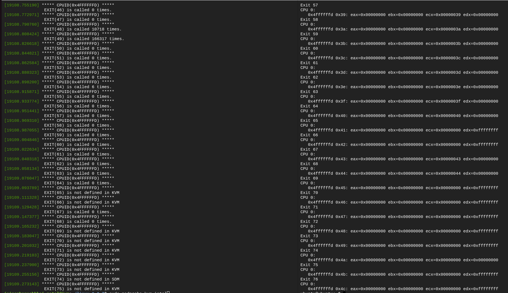

# CMPE 283 Assignment 3 

- The assignment is performed on Google Cloud VM supporting nested virtualiztion(`--enable-nested-virtualization`).
- Configuration: 
  - Machine Type: **n2-standard-8**
  - CPU platform: **Intel Cascade Lake**

<br />

- Assignment 3 modifies the behavior of the **cpuid** instruction for the following cases:
  - CPUID leaf node(`%eax=0x4ffffffd`)
    - Return the total number of exits for an exit number(passed as parameter) in **%ecx**, return the value in **%eax**.
  - CPUID lead node(`%eax=0x4ffffffc`) 
    - Return the total time spent processing the exit number(passed as parameter) in **%ecx**. The value is measured in cycles. 
    - Return the high 32 bits of the total time spent processing for an exit number in **%ebx**.
    - Return the low 32 bits of the total time spent processing for an exit number in **%ecx**.

<br />

## Question 1:
  - Assignment done By myself.

<br />

## Question 2: (Steps used to complete the assignment)
1) Downloaded the source code in the VM from [official kernel website](https://www.kernel.org/).
    ```
    sudo apt-get install wget
    wget https://cdn.kernel.org/pub/linux/kernel/v6.x/linux-6.0.7.tar.xz
    ```

2) Extract the source code 
    ```
    tar xvf linux-6.0.7.tar.xz
    ```

3) Install all required packages before building the kernel.
    ```
    sudo apt-get install git fakeroot build-essential ncurses-dev xz-utils libssl-dev bc flex libelf-dev bison
    ```

4) Configuring the kernel by copying the existing configuration file to a `.config` file
    ```
    cd linux-6.0.7
    cp -v /boot/config-$(uname -r) .config
    ```

5) Build the kernel through the following commands:
    - `sudo make modules`
    - `sudo make`
    - While compiling the kernel, an error may occur saying `No rule to make target 'debian/canonical-certs.pem'`, then execute the below commands:
      - `scripts/config --disable SYSTEM_TRUSTED_KEYS`
      - `scripts/config --disable SYSTEM_REVOCATION_KEYS`
    - `sudo make modules_install`
    - `sudo make install`

6) Bootloader is automatically updated because of the `make install` and now we can reboot the system and check the kernel version
    - `sudo reboot`
    - `uname -mrs` 
    - Output: **Linux 6.0.7 x86_64**
    
    

7) Made the code changes in the linux kernel code. Overwrite the below files with the files in this repo.
   - **vmx.c**: `/linux-6.0.7/arch/x86/kvm/vmx/vmx.c`
   - **cpuid.c**: `/linux-6.0.7/arch/x86/kvm/cpuid.c` 

8) Built and installed modules again
    - `sudo make modules && sudo make modules_install`

9) For loading the newly built modules, perform following commands:
   - `sudo rmmod kvm_intel`
   - `sudo rmmod kvm`
   - `sudo modprode kvm`
   - `sudo modprobe kvm_intel`
  
10) For testing the functionality, an nested VM was created in the GCP VM. The steps to create an nested VM are as follows:
    - Download the Ubuntu cloud image`.img`(QEMU compatible image) file from this [ubuntu cloud images site] in GCP VM(https://cloud-images.ubuntu.com/).
    ```
    wget https://cloud-images.ubuntu.com/bionic/current/bionic-server-cloudimg-amd64.img
    ```
    - Install the required qemu packages
    ```
    sudo apt update && sudo apt install qemu-kvm -y
    ```
    -Move to the directory where .img file is downloaded. This ubuntu cloud image does not come with a default password for the vm. So, to change the password and login into the vm, perform these following steps(terminal):
    ```
    1)  sudo apt-get install cloud-image-utils

    2)  cat >user-data <<EOF
        #cloud-config
        password: newpass #new password here
        chpasswd: { expire: False }
        ssh_pwauth: True
        EOF

    3)  cloud-localds user-data.img user-data
    ```
    - Now, to run this ubuntu image, execute this:
    ```
    sudo qemu-system-x86_64 -enable-kvm -hda bionic-server-cloudimg-amd64.img -drive "file=user-data.img,format=raw" -m 512 -curses -nographic
    ```

    - **username**: `ubuntu`
    - **password**: `newpass`

    - Now to check the functionality, we need the cpuid utility package, for that
    ```
    sudo apt-get update
    sudo apt-get install cpuid
    ```

  - NOTE: Make sure two terminals are open:
      - the GCP VM terminal(T1)
      - the nested VM terminal(logged in)(T2)

<br />

11) In T2, write a new test script(filename="test_cpuid.sh") as follows:
    ```
    #!/bin/bash

    for i in {0..76}
    do
        echo "EXIT $i"
        cpuid -l $1 -s $i
    done
    ```
12) Testing the CPUID functionality for `%eax=0x4ffffffd`
  - T2: `bash test_cpuid.sh -0x4ffffffd`
  - T1: `sudo dmesg` 

    
    
    

13)    Testing the CPUID functionality for `%eax=0x4ffffffc`
  - T2: `bash test_cpuid.sh 0x4ffffffc`
  - T1: `sudo dmesg` 

    
    
    
    
    

## Question 3: 
Comment on the frequency of exits – does the number of exits increase at a stable rate? Or are theremore exits performed during certain VM operations? Approximately how many exits does a full VM boot entail?

- For exits, **HLT(10)** and **CPUID(12)** the number of exits increases at a stable rates as these exits are called fairly regularly.
  
  Output:
  
  

<br />

## Question 4: 
- Following are some of the most frequently called exits:
  - Exit #49 - EPT_MISCONFIG
  - Exit #30 - IO_INSTRUCTION
  - Exit #28 - CR_ACCESS
  - 
- Following are some of the least frequently called exits(>0):
  - Exit #54 - WBINVD
  - Exit #29 - DR_ACCESS
  - Exit #0 - EXCEPTION_NMI
